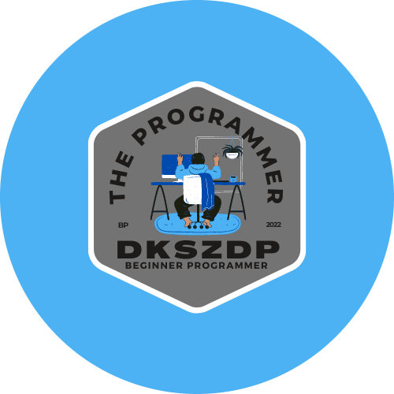

  
  <h2 align="center">Portafolio Personal</h2>
  <h4 align="center">Proyecto de un portafolio personal creado por dkszdp ⚡</h4>

  
  

  
Contenidos

  <ol>
    <li><a href="#sobreelproyecto">Sobre el proyecto</a></li>
    <li><a href="#codificacion">Codificación</a></li>
    <li><a href="traduccion">Traducciones</a></li>
    <li><a href="#roadmap">Roadmap</a></li>
    <li><a href="#contacto">Contacto</a></li>
  </ol>

### Sobre el proyecto 📑
Proyecto desarrollado para la obtención de un portafolio o contenedor de algunos de mis trabajos o proyectos.

### Codificado con 📝

### Traducciones del README
<kbd></kbd>
<kbd></kbd>

### Roadmap 🚀
- [x] Desarrollar el Portafolio
- [x] Subirlo a GitHub Pages
- [ ] Terminar de añadir los trabajos y/o proyectos
- [x] Subir el README principal
    - [x] Poner en el README los shields del html y css
- [x] Traducir el README a inglés

### Contacto 📱
- [**dkszdp**⚡](https://github.com/dkszdp)
- [**Visualiza el proyecto**](https://dkszdp.github.io/portafolio-dkszdp/)

<a href="#top">⬆</a>
